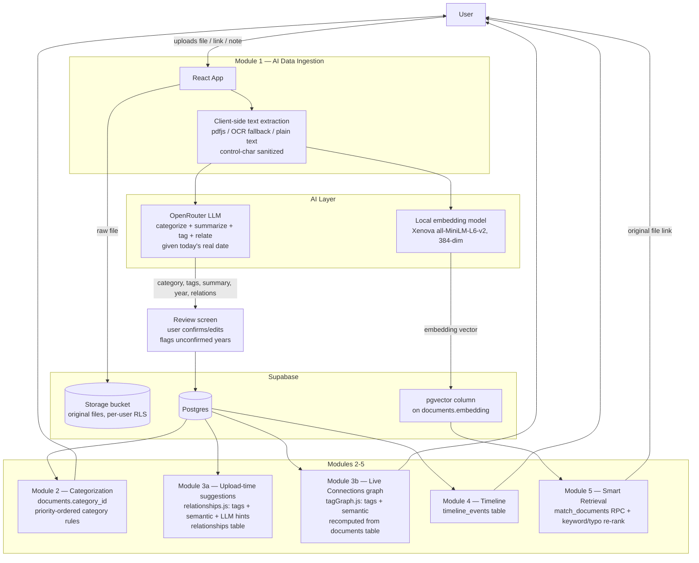

# MemoryVerse AI — Architecture

## System diagram

## Data model

Pulled directly from the live Supabase project (verified via `list_tables` +
`pg_policies`/`pg_proc` — not hand-written from memory). Full DDL, RLS
policies, and functions are in [`supabase/schema.sql`](./supabase/schema.sql).

| Table | Purpose | Notable columns |
|---|---|---|
| `profiles` | One row per user, auto-created via `handle_new_user()` trigger on `auth.users` insert | `full_name`, `avatar_url`, `email`, `bio`, `github_url`, `linkedin_url`, `theme`, `auto_categorize`, `auto_relationships` |
| `categories` | Fixed taxonomy, public read-only | `name` (Projects, Skills, Certifications, Internships, Achievements, Academics), `icon`, `description` |
| `documents` | Every ingested item | `raw_text`, `ai_summary`, `category_id`, `tags text[]`, `event_year`, `embedding vector(384)`, `metadata jsonb`, `updated_at` |
| `relationships` | Directed links between two documents | `relation_type` (currently `ai_inferred`), `confidence float8`, `label` |
| `timeline_events` | Year-indexed events for the timeline view | `event_year`, `event_date` |
| `storage.objects` (bucket `documents`, private) | Original files, path-scoped `{user_id}/...`, RLS-protected | — |

RLS: every user-owned table uses `auth.uid() = user_id` (or `= id` for
`profiles`) on `for all`, so a user can only ever read/write their own rows —
verified directly against `pg_policies` on the live project, not assumed from
the code.

## Why these AI choices

- **Categorization / relationship extraction — OpenRouter, free-tier LLM
  (`openrouter/free`).** A single structured-JSON prompt does classification,
  summarization, tagging, year inference, and relationship hinting in one
  call. The prompt gives the model today's actual date (an LLM has no innate
  sense of "now") and an explicit category priority order, since without one
  a free/small model categorizes the same *kind* of document inconsistently
  between calls (e.g. an internship's GitHub portfolio landing in "Projects"
  one time and "Internships" the next).

- **Embeddings — local, not API-based.** Running `all-MiniLM-L6-v2` in the
  browser via `@xenova/transformers` means semantic search has zero marginal
  cost and no rate limit, and no document text has to leave the user's
  machine to be embedded. The 384-dimension output maps directly onto a
  `pgvector` column in Postgres.

- **Retrieval — cosine similarity via `pgvector`, not keyword search.**
  `match_documents()` embeds the user's natural-language query the same way
  and ranks documents by vector distance, so "show my AI projects" matches
  documents that never contain the literal word "AI." `rankArchiveDocuments`
  then re-ranks that shortlist with keyword and category-intent scoring
  (with light edit-distance tolerance, so "achivements" still resolves to
  the Achievements category) before results reach the user.

- **Two relationship code paths, one shared logic.** The Relationship Engine
  runs in two places for two different reasons, and both use the same two
  signals — shared tags and embedding cosine similarity — so they never
  disagree with each other:
  - `relationships.js`, at upload-review time: also factors in the LLM's own
    `relations` hints (e.g. `certification_to_skill`), since those are only
    available in memory before the document is saved. Suggestions are shown
    to the user, who approves which ones get written to `relationships`.
  - `tagGraph.js`, for the Connections graph, Dashboard, and Profile stats:
    recomputes edges live from the `documents` table on every load. It can't
    use LLM relation hints, because `relations` isn't a persisted column —
    only tags and the stored embedding survive a reload.

- **Human-in-the-loop by design, not as a fallback.** Every AI output —
  category, year, tags, relationships — is shown to the user before saving,
  and nothing is hidden as "confident" when it isn't: if no year is found
  anywhere in a document's text, the review screen flags it for the user to
  confirm rather than silently guessing one.

## Request flow (a single upload, end to end)

1. Browser extracts text from the file (OCR fallback for scanned PDFs/images),
   sanitized of control characters some PDF text layers introduce
2. Text + today's date → OpenRouter → structured JSON (title, category, summary,
   tags, year, relations)
3. If no year is found in the source text, the returned year is marked
   `yearConfident: false` and flagged on the review screen
4. Title + summary + tags → local embedding model → 384-dim vector
5. User reviews/edits every field, including AI-suggested connections
   (tags + semantic similarity + relation hints against existing documents)
6. File → Supabase Storage (private, user-scoped path)
7. Row → `documents` table (RLS: only the owning user can read/write it)
8. Row → `timeline_events` table
9. Approved relationship suggestions → `relationships` table
10. Dashboard, Timeline, Connections, and Search all read from the same
    `documents` table — there is no separate sync step. The Connections graph
    additionally recomputes its own edges live via `tagGraph.js` on each load.