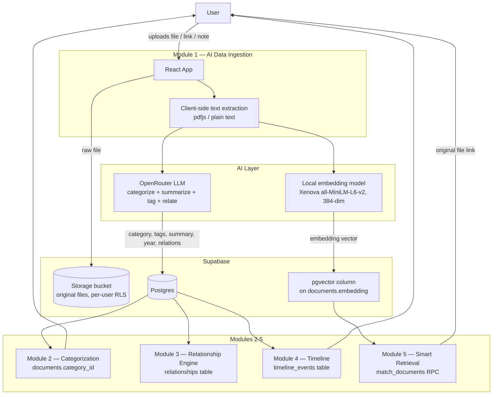

# MemoryVerse AI — Architecture

## System diagram

## Data model

| Table | Purpose |
|---|---|
| `profiles` | One row per user, auto-created via `auth.users` trigger on signup |
| `categories` | Fixed taxonomy: Projects, Skills, Certifications, Internships, Achievements, Academics |
| `documents` | Every ingested item — raw text, AI summary, category, tags, year, `vector(384)` embedding |
| `relationships` | Directed links between documents (e.g. `certification_to_skill`) |
| `timeline_events` | Denormalized year-indexed events for the timeline view |
| `storage.objects` (bucket `documents`) | Original files, path-scoped per user, RLS-protected |

## Why these AI choices

- **Categorization / relationship extraction — OpenRouter, free-tier LLM.**
  A single structured-JSON prompt does classification, summarization, tagging,
  year inference, and relationship hinting in one call — no separate NLP
  pipeline needed, and it costs nothing to run at hackathon scale.

- **Embeddings — local, not API-based.** Running `all-MiniLM-L6-v2` in the
  browser via `@xenova/transformers` means semantic search has zero marginal
  cost and no rate limit, and no document text has to leave the user's
  machine to be embedded. The 384-dimension output maps directly onto a
  `pgvector` column in Postgres.

- **Retrieval — cosine similarity via `pgvector`, not keyword search.**
  `match_documents()` embeds the user's natural-language query the same way
  and ranks documents by vector distance, so "show my AI projects" matches
  documents that never contain the literal word "AI."

## Request flow (a single upload, end to end)

1. Browser extracts text from the file (or uses the pasted link/note)
2. Text → OpenRouter → structured JSON (title, category, summary, tags, year, relations)
3. Title + summary + tags → local embedding model → 384-dim vector
4. File → Supabase Storage (private, user-scoped path)
5. Row → `documents` table (RLS: only the owning user can read/write it)
6. Row → `timeline_events` table
7. Relationship hints → `relationships` table
8. Dashboard, Timeline, and Search all read from the same `documents` table —
   there is no separate sync step.
